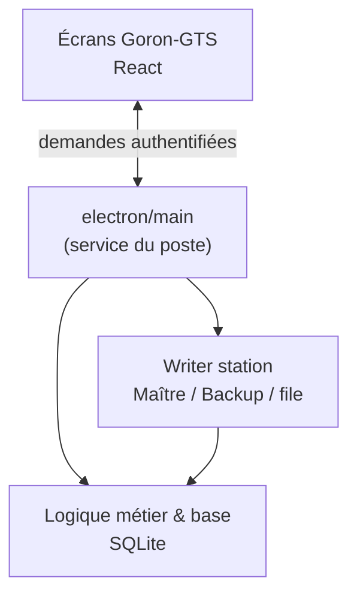

# Goron-GTS — Dossier `electron/main` (vue responsables)

Présentation **non technique** du rôle du dossier `electron/main` dans le projet.  
Ce dossier regroupe les briques qui font fonctionner l’application bureau **avant** les écrans métier : configuration du poste, base de données, mode multi-postes (writer), liaison avec l’interface, modèles Word, archivage.

> **Périmètre de ce document** : uniquement `electron/main`. Vue d’ensemble du moteur bureau : [Presentation-electron.md](./Presentation-electron.md).

---

## 1. Pourquoi ce dossier existe

Sur chaque PC, Goron-GTS doit répondre à des questions concrètes :

- Quelle base de données est utilisée ? Peut-on consulter une archive ?
- Ce poste est-il Maître, Backup ou simple poste de saisie ?
- Si le Maître est indisponible, que se passe-t-il pour les saisies en cours ?
- Comment l’interface « parle » au moteur sans exposer la base à tous les postes en direct ?

Le dossier **`electron/main`** regroupe ces responsabilités en **modules séparés et documentés**, plutôt qu’un seul bloc difficile à maintenir. C’est le **service d’exploitation local** de l’application.

---

## 2. Rôle global en une phrase

**`electron/main` est le chef d’orchestre du poste Windows** : il prépare l’environnement, applique les règles station (writer, droits, archives), et transmet les demandes des écrans vers la base de façon contrôlée.

---

## 3. Les grandes familles de briques (sans jargon code)

| Famille | Rôle pour la station | Exemple concret côté terrain |
|--------|----------------------|------------------------------|
| **Configuration du poste** | Mémoriser où est la base, la taille de la fenêtre, le dernier fichier de config writer | Un redémarrage retrouve la même base et la même disposition |
| **Données & chemins** | Savoir où sont la base active, les archives trimestrielles, les dossiers `Activedb` / `Archives` | Bascule vers une archive Q1 sans mélanger les fichiers |
| **Administration base** | Lister les bases disponibles, changer la base active, gérer une « session archive » (qui a ouvert quoi) | Le responsable ouvre une archive ; les autres voient que c’est en lecture contrôlée |
| **Droits sur la base** | Qui peut changer la base, lancer un archivage manuel, ouvrir une archive | Seuls directeur / responsable station / profil dev selon les règles définies |
| **Connexion & session** | Login, premier mot de passe, déconnexion, code admin local | L’opérateur se connecte ; la session limite les accès anonymes |
| **Liaison écrans ↔ moteur** | Tous les appels métier (listes, créations, modifications) passent par des canaux sécurisés | La main courante affichée dans l’app vient bien du store, pas d’un accès direct multi-poste |
| **Paramètres & système** | État writer, choix de base au premier lancement, modèles Word, dossier logs, quitter / réduire | L’écran Paramètres affiche Maître/Backup, file d’attente, ouverture du dossier modèles |
| **Writer — pilotage** | Déterminer le rôle du poste (Maître / Backup / client) et démarrer les bons services | Après changement de config, le poste se repositionne tout seul |
| **Writer — réseau & file** | Envoyer les écritures des clients, traiter la file sur le Maître, secours sur Backup | Un client enregistre une intervention ; le Maître valide ; sinon attente visible |
| **Writer — surveillance** | Savoir si l’autre poste (Backup ou Maître) répond ; heartbeats en mode partage fichier | Alerte si le partenaire writer ne répond plus |
| **Writer — logs** | Garder une trace technique des échanges writer pour le support | En cas de litige « ça n’a pas enregistré », on peut reconstituer le scénario |
| **Archivage automatique** | Lancer à intervalle (ou à la demande autorisée) rotation + archivage logique main courante | Fin de trimestre : données anciennes rangées sans action manuelle risquée |
| **Modèles Word** | Stocker et proposer les `.docx` d’export (intégrés + personnalisés) | Export main courante avec le bon modèle station |
| **Fenêtre & tray** | Fenêtre principale, réduction intelligente sur Maître/Backup (icône barre des tâches) | Le Maître reste ouvert en arrière-plan sans encombrer le bureau |

Chaque ligne correspond à un ou plusieurs fichiers du dossier ; l’important pour les responsables est la **répartition claire des rôles**, pas les noms de fichiers.

---

## 4. Schéma : place de `electron/main` dans l’application

Les équipes ne voient que **UI** ; `electron/main` assure que les règles station sont respectées entre **UI** et **base**.

---

## 5. Ce que le travail récent apporte (documentation de ce dossier)

Le dossier a été **parcouru module par module** avec :

- une description du rôle de chaque brique ;
- une vérification qu’elle est bien utilisée (pas de code « mort » laissé en place) ;
- une trace écrite pour les personnes qui feront évoluer le produit plus tard.

**Pour les responsables, les bénéfices sont :**

| Bénéfice | Impact métier |
|----------|----------------|
| **Lisibilité** | On sait « qui fait quoi » sur le poste (base, writer, exports, archivage). |
| **Sécurité d’évolution** | Ajouter un module métier ne casse pas silencieusement le writer ou les archives. |
| **Support** | Un incident est plus vite classé : base, writer, modèle, session archive, etc. |
| **Formation interne** | Un référent peut expliquer le mode Maître/Backup sans lire tout le projet. |

Il ne s’agit pas d’un manuel utilisateur terrain, mais d’une **carte du moteur local** pour la direction technique et les chefs de projet.

---

## 6. Ce que ce dossier ne fait pas (limites utiles en réunion)

- Il ne définit pas les **règles métier** des écrans (statuts intervention, clôture main courante, etc.) — elles vivent ailleurs dans l’application.
- Il ne remplace pas le **guide réseau / IT** (IP, pare-feu, partage SMB).
- Il ne couvre pas le **design des écrans** ni la formation des opérateurs au clavier.

Cela évite les malentendus du type « tout est dans main » : c’est le **socle du poste**, pas tout Goron-GTS.

---

## 7. Suite prévue : une présentation par dossier

Même format que ce document, **un fichier de présentation par grande zone du projet**, par exemple :

| Dossier | Sujet de la fiche |
|---------|-------------------|
| **`electron`** | Vue d’ensemble moteur bureau — [Presentation-electron.md](./Presentation-electron.md) |
| **`electron/main`** (ce document) | Service du poste, writer, base, liaison UI |
| **`electron/store/core`** | Socle base, droits, audit, sessions — [Presentation-electron-store-core.md](./Presentation-electron-store-core.md) |
| **`electron/store/domains`** | Règles métier par module — [Presentation-electron-store-domains.md](./Presentation-electron-store-domains.md) |
| Interface (`src/features/…`) (à venir) | Parcours utilisateur par module métier |

L’objectif est un **catalogue de fiches responsables**, pas une documentation développeur.

---

## 8. Message clé pour une présentation orale (30 secondes)

> Le dossier `electron/main`, c’est tout ce qui fait qu’un PC de station se comporte correctement : la bonne base, le bon rôle Maître ou client, la reprise si le Maître tombe, les exports Word et l’archivage. On vient de le structurer et le documenter pour que le projet Goron-GTS reste maîtrisable quand on ajoute de nouveaux modules à l’écran.

---

*Fiche responsables — dossier `electron/main` — mai 2026.*
