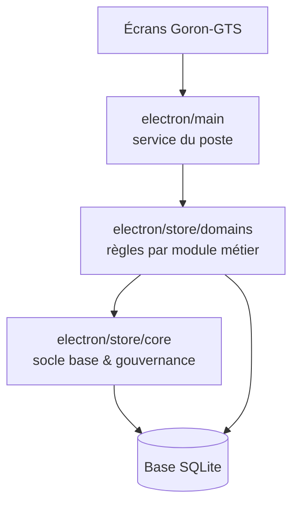

# Goron-GTS — Dossier `electron/store/core` (vue responsables)

Présentation **non technique** du rôle du dossier `electron/store/core` dans le projet.  
Ce dossier regroupe les **fondations communes** de la base de données et des règles transverses : structure des tables, sécurité des comptes, journal d’audit, sessions, erreurs. Les écrans métier (main courante, interventions, rondes, etc.) s’appuient sur ces briques sans les dupliquer.

> **Périmètre de ce document** : uniquement `electron/store/core`. Vue d’ensemble : [Presentation-electron.md](./Presentation-electron.md). Métier par module : [Presentation-electron-store-domains.md](./Presentation-electron-store-domains.md).

---

## 1. Pourquoi ce dossier existe

Chaque poste Goron-GTS partage les mêmes besoins « sous le capot » :

- Où et comment sont créées les **tables** de la base au premier lancement ?
- Comment un **login** reste valide sans exposer les mots de passe en clair ?
- Qui a le droit de faire quoi (**rôles**, accès aux pages) ?
- Chaque **modification sensible** doit-elle laisser une trace pour le support et la direction ?

Le dossier **`electron/store/core`** centralise ces réponses en **petits modules réutilisables**, pour que l’ajout d’un nouvel écran métier ne recrée pas à chaque fois la gestion des mots de passe ou du schéma SQL.

---

## 2. Rôle global en une phrase

**`electron/store/core` est le socle de données et de gouvernance** : il prépare la base, applique les règles communes (droits, audit, sessions) et fournit des outils partagés aux modules métier.

---

## 3. Les grandes familles de briques (sans jargon code)

| Famille | Rôle pour la station | Exemple concret côté terrain |
|--------|----------------------|------------------------------|
| **Structure de la base (schémas)** | Créer ou mettre à jour les tables au démarrage (utilisateurs, main courante, interventions, rondes, gardiennage, référentiels) | Une nouvelle version de l’app ouvre la base sans migration manuelle risquée |
| **Droits de navigation** | Mémoriser quelles pages chaque compte peut voir (main courante, Fransor, paramètres, etc.) | Un opérateur n’accède pas aux paramètres station ; un responsable oui |
| **Rôles et permissions (RBAC)** | Vérifier qu’une action est autorisée selon le profil (opérateur, responsable, admin) | Seul un profil autorisé crée un compte ou modifie les droits |
| **Mots de passe & accès admin** | Hachage sécurisé, premier mot de passe, code admin local de secours | Connexion conforme aux bonnes pratiques ; pas de mot de passe stocké en clair |
| **Sessions** | Lier une connexion à la base active ; une session par utilisateur ; durée limitée (13 h) | Changement de base trimestrielle : les anciennes sessions ne « suivent » pas par erreur |
| **Journal d’audit** | Enregistrer qui a créé, modifié ou supprimé quoi, avec libellés lisibles | « Qui a clôturé cette information ? » — réponse traçable |
| **Historique d’entité** | Conserver les derniers changements sur les données sensibles (référentiels, etc.) | Comprendre l’évolution d’un site ou d’un paramètre avant une réclamation |
| **Erreurs & logs techniques** | Messages clairs pour l’utilisateur ; détail technique pour le support | L’écran affiche un message simple ; le support consulte le détail sans exposer la stack à l’opérateur |
| **Identifiants & démarrage** | Génération d’identifiants uniques ; initialisation minimale de la base | Pas de doublons silencieux à l’import ou à la création |
| **Bootstrap** | Préparer l’état initial attendu au premier usage | Première installation cohérente sur un poste vierge |

Chaque ligne correspond à un ou plusieurs fichiers du dossier ; l’important pour les responsables est la **cohérence du socle**, pas les noms de fichiers.

---

## 4. Schéma : place de `electron/store/core` dans l’application

Les équipes voient les **écrans** ; le **core** garantit que toutes les écritures métier respectent les mêmes règles de structure, droits et traçabilité.

---

## 5. Ordre logique au démarrage de la base (pour la compréhension métier)

Au lancement de l’application sur un poste, le socle prépare la base dans un ordre maîtrisé :

1. **Tables fondamentales** (comptes, journaux, main courante, interventions, sites, etc.)
2. **Module rondes** (passages, motifs, planification, jours fériés)
3. **Droits de navigation** des comptes existants (mise à jour des accès pages, dont le gardiennage)
4. **Données métier complémentaires** (référentiels partagés)
5. **Gardiennage** (table dédiée aux prestations planifiées)

Cet enchaînement évite qu’une mise à jour partielle laisse des comptes ou des tables dans un état incohérent.

---

## 6. Ce que le travail récent apporte (documentation de ce dossier)

Le dossier a été **parcouru module par module** avec :

- une description du rôle de chaque brique ;
- une vérification qu’elle est bien utilisée (retrait de code ou d’exports inutiles) ;
- des corrections ciblées (ex. droit **gardiennage** bien conservé dans les accès pages au redémarrage) ;
- une trace écrite pour les évolutions futures.

**Pour les responsables, les bénéfices sont :**

| Bénéfice | Impact métier |
|----------|----------------|
| **Traçabilité** | Les actions sensibles restent explicables en cas de litige ou de contrôle. |
| **Sécurité des comptes** | Sessions, mots de passe et rôles alignés sur l’exploitation réelle (vacations, un poste = une session active). |
| **Évolutivité** | Nouveau module métier : on branche sur le socle au lieu de recopier l’audit ou le schéma. |
| **Support** | Un incident se classe plus vite : connexion, droits, structure base, audit. |

---

## 7. Ce que ce dossier ne fait pas (limites utiles en réunion)

- Il ne contient pas les **écrans** ni les parcours utilisateur détaillés.
- Il ne gère pas le **writer multi-postes** (file d’attente Maître/Backup) — c’est le rôle de `electron/main`.
- Il ne remplace pas les **procédures métier** terrain (quand clôturer, qui valide une ronde, etc.) — celles-ci sont dans les domaines métier et l’interface.

C’est le **plancher de la maison**, pas les pièces meublées.

---

## 8. Suite prévue : une présentation par dossier

Même format que les autres fiches responsables :

| Dossier | Sujet de la fiche |
|---------|-------------------|
| **`electron`** | Vue d’ensemble — [Presentation-electron.md](./Presentation-electron.md) |
| **`electron/main`** | Service du poste, writer, base, liaison UI |
| **`electron/store/core`** (ce document) | Socle base, droits, audit, sessions |
| **`electron/store/domains`** | Règles par module — [Presentation-electron-store-domains.md](./Presentation-electron-store-domains.md) |
| Interface (`src/features/…`) | Parcours utilisateur par écran |

---

## 9. Message clé pour une présentation orale (30 secondes)

> Le dossier `electron/store/core`, c’est tout ce qui est commun à la base Goron-GTS : créer les tables, sécuriser les comptes, savoir qui est connecté, journaliser les changements importants et préparer les droits d’accès aux écrans. On vient de le documenter pour que chaque nouveau module métier s’appuie sur le même socle fiable, sans surprises au redémarrage ou à l’audit.

---

*Fiche responsables — dossier `electron/store/core` — mai 2026.*
