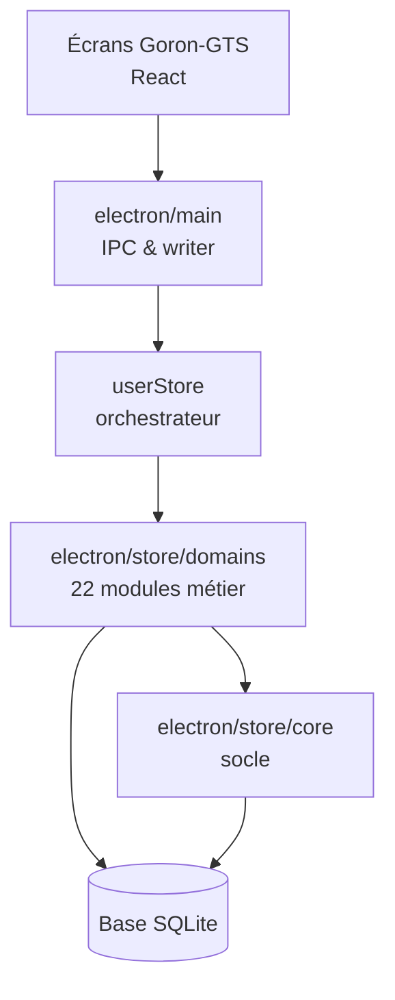

# Goron-GTS — Dossier `electron/store/domains` (vue responsables)

Présentation **non technique** du rôle du dossier `electron/store/domains` dans le projet.  
Ce dossier regroupe la **logique métier par module** : main courante, interventions, rondes, gardiennage, utilisateurs, référentiels, exports Word, etc. Chaque fichier correspond à un domaine d’exploitation ; ils s’appuient sur le socle `electron/store/core` (tables, droits, audit) et sont appelés par l’orchestrateur `userStore`, lui-même sollicité par les écrans via `electron/main`.

> **Périmètre de ce document** : uniquement `electron/store/domains`. Vue d’ensemble : [Presentation-electron.md](./Presentation-electron.md). Writer / poste : [Presentation-electron-main.md](./Presentation-electron-main.md). Socle : [Presentation-electron-store-core.md](./Presentation-electron-store-core.md).

---

## 1. Pourquoi ce dossier existe

Les écrans Goron-GTS posent des questions métier précises :

- Comment créer, modifier ou clôturer une **information** de main courante ?
- Comment planifier une **ronde**, gérer les créneaux exceptionnels et les profils planifiés ?
- Comment enregistrer une **intervention** et produire un export Word cohérent ?
- Comment générer et resynchroniser le **gardiennage** à partir d’un modèle de planification ?
- Qui peut créer un **compte**, quels **sites** et **référentiels** sont disponibles ?

Plutôt qu’un seul fichier géant, le projet répartit ces règles en **modules indépendants** : un incident sur les rondes n’oblige pas à toucher à la main courante, et chaque évolution reste localisée.

---

## 2. Rôle global en une phrase

**`electron/store/domains` est la couche « métier » de la base** : elle applique les règles de chaque module (validations, statuts, planification, imports, exports) et journalise les écritures sensibles conformément aux exigences d’audit du produit.

---

## 3. Carte des modules (sans jargon code)

| Zone métier | Modules du dossier | Ce que ça couvre côté terrain |
|-------------|-------------------|------------------------------|
| **Main courante** | `mainCourante`, `archive` | Saisie, suivi et clôture des informations ; archivage logique des données anciennes |
| **Interventions** | `intervention`, `interventionWordExtraFields` | Cycle de vie des interventions ; champs supplémentaires pour les exports Word |
| **Rondes** | `ronde`, `rondePlannedProfiles`, `rondeMotifTypes`, `rondeExceptionalSlotsEngine`, `rondeAutoClose` | Planification, motifs, créneaux exceptionnels, profils planifiés, clôture automatique |
| **Gardiennage** | `gardiennage`, `gardiennagePlannerEngine`, `gardiennageAutoClose` | Prestations planifiées, moteur de génération / resynchronisation, clôture automatique |
| **Calendrier** | `holidays` | Jours fériés utilisés par la planification ronde / gardiennage |
| **Fransor** | `fransor` | Exceptions et règles spécifiques au module Fransor |
| **Référentiels & données** | `referentials`, `formVariables` | Sites, intervenants, listes partagées ; variables de formulaire |
| **Utilisateurs & préférences** | `authUsers`, `userPreferences` | Comptes, rôles, droits pages ; thème clair/sombre par utilisateur |
| **Modèles Word** | `templateAssignments` | Attribution d’un fichier `.docx` par flux (intervention, ronde, gardiennage) et par site ou famille |
| **Imports & qualité** | `importAudit`, `dbHealth` | Traçabilité des imports de masse ; contrôles simples sur l’état de la base |
| **Journal consultation** | `auditLogs` | Lecture filtrée du journal d’actions pour l’écran d’audit |

L’orchestrateur **`userStore`** expose ces modules vers l’interface ; les responsables n’ont pas à connaître ce découpage fichier par fichier, mais la **carte métier** ci-dessus aide à cadrer un incident ou une évolution produit.

---

## 4. Schéma : place de `electron/store/domains` dans l’application

Les **écrans** ne parlent pas directement à la base : chaque action passe par le store, qui délègue au bon **domaine**.

---

## 5. Règles transverses respectées par ces modules

| Règle produit | Conséquence pour les responsables |
|---------------|----------------------------------|
| **Une seule écriture active** (writer Maître/Backup) | Les domaines préparent les écritures ; le poste client peut mettre en file d’attente si le writer est indisponible |
| **Audit des modifications** | Création, modification, suppression métier → trace dans le journal (libellés du type `[Page] Donnée`) |
| **Droits par rôle** | Lecture vs gestion des données selon le profil ; certaines actions réservées aux responsables |
| **Pas d’identifiants techniques en interface** | Les domaines manipulent des IDs en interne ; l’UI affiche des libellés métier |
| **Imports de masse** | Un log résumé par lot, pas une ligne de journal par ligne importée |

Ces principes sont implémentés module par module ; le socle `core` fournit les briques communes (audit, RBAC, schéma).

---

## 6. Ce que le travail récent apporte (documentation de ce dossier)

**22 fichiers** du dossier ont été parcourus un par un (commits `docs(store): JSDoc …` sur la branche `dev`, poussés sur `origin/dev`).

Pour chaque module :

- description du rôle en tête de fichier ;
- vérification d’usage dans le projet (retrait d’exports ou d’imports inutiles lorsque pertinent) ;
- alignement sur les conventions du produit (audit, messages d’erreur en français côté métier).

**Exemples de nettoyage ciblé (sans impact fonctionnel attendu) :**

- retrait d’exports de fonctions de mapping utilisées uniquement en interne ;
- retrait de constantes dupliquées côté interface (déjà définies dans les types frontend) ;
- correction de cohérence des droits pages (ex. **gardiennage** conservé au redémarrage — traité aussi dans `core`).

**Fichiers volumineux** (au-dessus de la limite projet ~800 lignes) : `gardiennage.js`, `intervention.js`, `ronde.js`, `rondePlannedProfiles.js`. La documentation a été ajoutée sans découpage ; un **split par responsabilité** est recommandé avant d’y ajouter de grosses évolutions.

**Pour les responsables, les bénéfices sont :**

| Bénéfice | Impact métier |
|----------|----------------|
| **Cartographie claire** | On sait quel fichier / module traiter pour un bug « ronde » vs « main courante » |
| **Traçabilité** | Les écritures sensibles restent explicables module par module |
| **Évolutivité** | Nouveau besoin métier → nouveau domaine ou extension ciblée, sans casser tout le store |
| **Support** | Classification plus rapide : planification, export Word, compte utilisateur, import Excel, etc. |

---

## 7. Ce que ce dossier ne fait pas (limites utiles en réunion)

- Il ne définit pas le **design des écrans** ni les raccourcis clavier — c’est `src/features/…`.
- Il ne gère pas le **writer**, la file d’attente ni le choix de base active — c’est `electron/main`.
- Il ne crée pas les **tables** au premier lancement — c’est `electron/store/core` (schémas).
- Ce n’est pas un **manuel utilisateur** terrain (procédures de vacation, consignes de clôture).

C’est la **logique métier en base**, pas toute l’application.

---

## 8. Liens avec les autres fiches responsables

| Dossier | Sujet de la fiche |
|---------|-------------------|
| **`electron`** | [Presentation-electron.md](./Presentation-electron.md) — vue d’ensemble moteur bureau |
| **`electron/main`** | [Presentation-electron-main.md](./Presentation-electron-main.md) — service du poste, writer, liaison UI |
| **`electron/store/core`** | [Presentation-electron-store-core.md](./Presentation-electron-store-core.md) — socle base, droits, audit, sessions |
| **`electron/store/domains`** (ce document) | Règles par module métier |
| Interface (`src/features/…`) | À venir — parcours utilisateur par écran |

---

## 9. Message clé pour une présentation orale (30 secondes)

> Le dossier `electron/store/domains`, c’est toute la logique métier Goron-GTS en base : main courante, interventions, rondes, gardiennage, comptes, référentiels et modèles Word. Chaque module est documenté et branché sur le même socle d’audit et de droits. On vient de finaliser cette cartographie pour que les évolutions produit restent maîtrisables, module par module.

---

*Fiche responsables — dossier `electron/store/domains` — mai 2026.*
