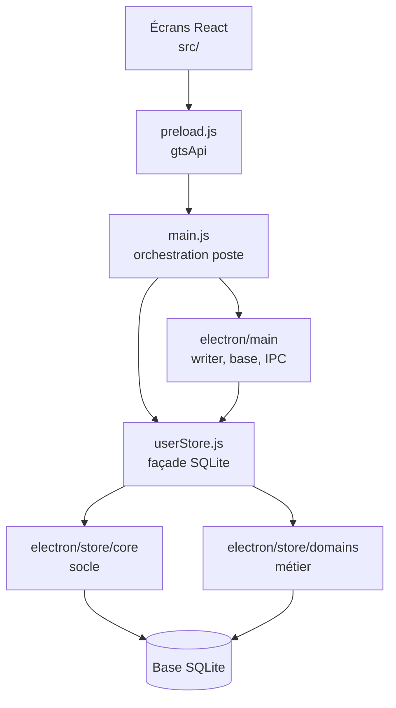

# Goron-GTS — Dossier `electron` (vue responsables)

Présentation **non technique** du rôle du dossier `electron` dans le projet Goron-GTS.  
C’est la **couche bureau Windows** de l’application : tout ce qui tourne hors des écrans React, pour parler à la base, gérer le poste (Maître / Backup / client) et sécuriser les échanges.

> **Périmètre** : l’ensemble `electron/` (processus principal, pont interface, logique base). Les écrans utilisateur sont dans `src/` — fiche à venir.

---

## 1. Pourquoi ce dossier existe

Goron-GTS n’est pas une simple page web : sur chaque PC de station il faut :

- ouvrir la **bonne base SQLite** (active, archives trimestrielles) ;
- garantir **un seul writer** à la fois pour les saisies ;
- **authentifier** les comptes et appliquer les **droits** ;
- **journaliser** les actions sensibles ;
- proposer les **exports Word** et l’**archivage** sans exposer la base à tous les postes en direct.

Le dossier **`electron`** regroupe tout ce moteur local. L’interface React ne fait que demander des actions ; le moteur décide, écrit et trace.

---

## 2. Rôle global en une phrase

**`electron` est le moteur Goron-GTS sur le poste** : il démarre l’application, relie les écrans à la base via un pont sécurisé, orchestre le writer multi-postes et applique les règles métier en SQLite.

---

## 3. Les quatre piliers (sans jargon code)

| Pilier | Emplacement | Rôle pour la station |
|--------|-------------|----------------------|
| **Entrée & cycle de vie** | `main.js` | Démarre l’app, fenêtre, planificateurs (archivage, clôtures auto), enregistre les canaux vers l’interface |
| **Pont interface ↔ moteur** | `preload.js` | Expose `window.gtsApi` : chaque action écran devient une demande contrôlée au processus principal |
| **Orchestrateur base** | `userStore.js` | Point unique vers la base : schémas, audit, droits, puis délégation aux modules métier |
| **Services du poste** | `main/` | Writer, choix de base, modèles Word, tray, IPC détaillés — voir fiche dédiée |
| **Socle données** | `store/core/` | Tables, sessions, mots de passe, RBAC, audit transverse — voir fiche dédiée |
| **Règles métier** | `store/domains/` | Main courante, interventions, rondes, gardiennage, comptes, référentiels… — voir fiche dédiée |

Les trois dernières lignes (`main`, `core`, `domains`) ont chacune une **fiche responsables détaillée** (liens ci-dessous).

---

## 4. Schéma : place de `electron` dans l’application

Les opérateurs ne voient que **UI** ; tout le reste assure cohérence, sécurité et reprise en cas d’indisponibilité du Maître.

---

## 5. Fiches détaillées par sous-dossier

| Zone | Fiche |
|------|--------|
| Services du poste (writer, base active, modèles, tray…) | [Presentation-electron-main.md](./Presentation-electron-main.md) |
| Socle base (schémas, comptes, audit, sessions) | [Presentation-electron-store-core.md](./Presentation-electron-store-core.md) |
| Logique métier par module | [Presentation-electron-store-domains.md](./Presentation-electron-store-domains.md) |

---

## 6. Ce que le travail récent apporte (documentation mai 2026)

L’ensemble du dossier **`electron`** a été parcouru module par module :

- **~120 fichiers** documentés en JSDoc (français), avec vérification d’usage ;
- retrait de **code mort** (exports inutilisés, doublons) ;
- commits sur la branche **`dev`** par zone (`main/`, `store/core`, `store/domains`, `main.js`, `preload.js`, `userStore.js`).

**Bénéfices pour les responsables :**

| Bénéfice | Impact |
|----------|--------|
| **Cartographie** | Incident ou évolution : on cible `main` (writer), `domains` (ronde), `core` (droits), etc. |
| **Maîtrise du writer** | Compréhension claire Maître / Backup / file d’attente / logs |
| **Traçabilité** | Audit et règles métier localisés, pas dispersés |
| **Onboarding** | Nouveaux développeurs ou référents IT : lecture par brique |

**Points d’attention** : quelques fichiers métier dépassent la taille cible (~800 lignes) — `gardiennage`, `intervention`, `ronde`, `main.js` — documentés mais à découper avant de grosses évolutions.

---

## 7. Ce que `electron` ne fait pas

- **Design des écrans** et parcours clavier → `src/features/…`
- **Réseau IT** (IP, pare-feu, partage SMB) → documentation d’exploitation station
- **Formation terrain** des procédures métier (vacation, clôture) → guides utilisateur

C’est le **moteur local**, pas tout le produit Goron-GTS.

---

## 8. Suite du catalogue de fiches

| Dossier | Statut |
|---------|--------|
| **`electron`** (ce document) | Vue d’ensemble |
| **`electron/main`**, **`store/core`**, **`store/domains`** | Fiches détaillées disponibles |
| **`src/features/…`** | À venir — parcours par écran |

---

## 9. Message clé pour une présentation orale (30 secondes)

> Le dossier `electron`, c’est tout le moteur Goron-GTS sur le PC : il connecte les écrans à la base, gère le Maître et le Backup, sécurise les comptes et applique les règles métier. On vient de le documenter entièrement pour que le produit reste évolutif et que le support sache où chercher quand un poste ne synchronise plus ou qu’une écriture échoue.

---

*Fiche responsables — dossier `electron` — mai 2026.*
