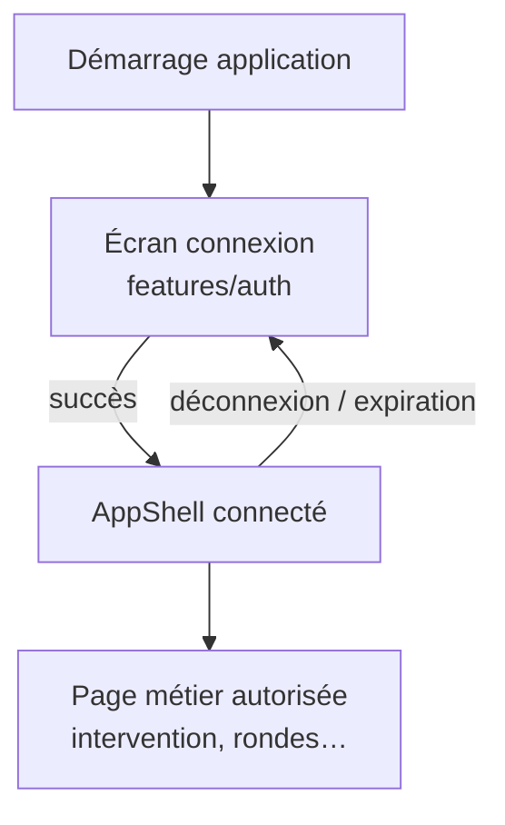

# Goron-GTS — Dossier `src/app` (vue responsables)

Présentation **non technique** du **shell applicatif** : ce qui entoure toutes les pages métier une fois l’utilisateur connecté.

> **Périmètre** : `src/app` (`SessionProvider`, `AppShell`). Les écrans métier détaillés sont dans les fiches `src/features/…`.

---

## 1. Pourquoi ce dossier existe

Goron-GTS n’est pas une simple succession de pages isolées. Il faut un **cadre commun** :

- savoir **qui est connecté** et maintenir la session ;
- afficher la **navigation** (sidebar) selon les droits du compte ;
- montrer l’**état technique** de la station (writer, file d’attente, base) ;
- proposer des **actions globales** : aide, thème clair/sombre, paramètres, fermeture.

Le dossier **`src/app`** regroupe cette coque, sans mélanger la logique métier des modules (interventions, rondes, etc.).

---

## 2. Rôle global en une phrase

**`src/app` est le cockpit de l’application** : connexion, session, sidebar, badges, toasts et ouverture des pages autorisées.

---

## 3. Les deux briques principales

| Brique | Rôle pour l’utilisateur |
|--------|------------------------|
| **Session** | Mémorise la connexion (jeton), déconnecte si la session expire ; en développement, peut restaurer la session au redémarrage |
| **AppShell** | Layout complet : logo, horloge, menu, contenu de la page active, indicateurs writer |

---

## 4. Parcours typique

---

## 5. Sidebar : ce que voit l’utilisateur

| Zone | Contenu |
|------|---------|
| **En-tête** | Logo GTS, nom affiché du compte, date et heure (format français) |
| **Navigation** | Boutons des modules **autorisés** pour ce profil (ordre fixe : intervention, rondes, gardiennage, main courante, Fransor, paramètres) |
| **Badges** | Compteurs utiles (ex. main courante non consultée, interventions ouvertes) |
| **Writer** | État Maître / Backup / Client, disponibilité, file d’attente si applicable |
| **Actions** | Aide, thème, paramètres (si droit), quitter l’application |

Seules les entrées **autorisées** par le compte sont visibles et cliquables.

---

## 6. Comportements transverses gérés par le shell

| Comportement | Intérêt métier |
|--------------|----------------|
| **Toasts** | Messages courts (succès, erreur, copie) en bas d’écran |
| **Centre d’aide** | Manuel intégré, rubrique initiale possible depuis Paramètres |
| **Modales déplaçables** | Déplacer les fenêtres par l’en-tête (double-clic pour recentrer) |
| **Thème** | Mode sombre ou clair, mémorisé sur le poste |
| **Liens entre modules** | Ex. ouvrir une intervention depuis une ronde (navigation guidée) |
| **Partage identifiants** | Après création de compte : affichage sécurisé du mot de passe temporaire |

---

## 7. Writer et mode dégradé

Le shell affiche clairement si la station **écrit** en base (writer actif) ou est en **lecture seule** / file d’attente.

- Les badges et libellés restent **lisibles** (pas de masquage silencieux).
- Les pages métier peuvent enregistrer en file d’attente ; le shell reflète l’état global.

---

## 8. Documentation technique (mai 2026)

Fichiers documentés (JSDoc, commits `docs(ui):` sur `dev`) :

- `session/SessionProvider.tsx`
- `AppShell.tsx`

Montés depuis `App.tsx` à la racine `src/`.

---

## 9. Liens avec les autres fiches

| Zone | Fiche |
|------|--------|
| Connexion | [Presentation-src-features-auth.md](./Presentation-src-features-auth.md) |
| Aide intégrée | [Presentation-src-features-help.md](./Presentation-src-features-help.md) |
| Composants partagés | [Presentation-src-features-common.md](./Presentation-src-features-common.md) |
| Bureau / writer | [Presentation-electron.md](./Presentation-electron.md) |

---

## 10. Message clé (30 secondes)

> Le dossier app, c’est la carrosserie de Goron-GTS : une fois connecté, la sidebar guide l’utilisateur vers ses modules, affiche l’état de la base et du writer, et centralise l’aide et les messages — sans qu’il ait à gérer la technique.

---

*Fiche responsables — dossier `src/app` — mai 2026.*
