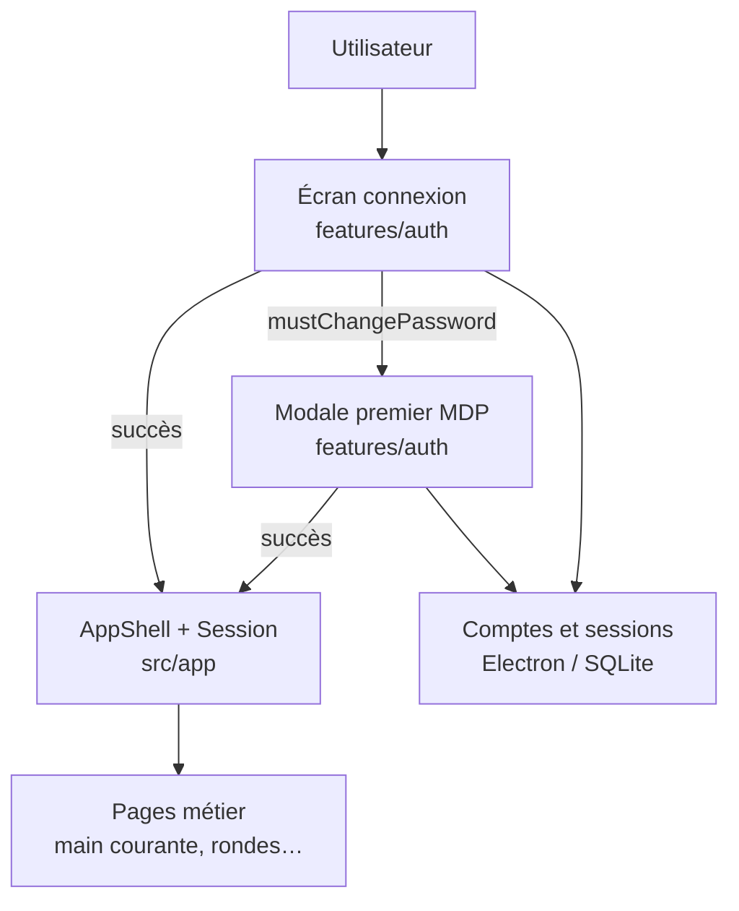

# Goron-GTS — Module `src/features/auth` (vue responsables)

Présentation **non technique** du module **authentification** côté interface.  
C’est ce que voit l’utilisateur **avant d’accéder** aux écrans métier (main courante, interventions, etc.) : connexion, premier mot de passe, compte bloqué, et prérequis base de données.

> **Périmètre** : `src/features/auth` uniquement. La session globale et le shell applicatif sont dans `src/app` (SessionProvider, AppShell). Le moteur comptes et mots de passe est côté Electron (`electron/store/domains/authUsers.js`).

---

## 1. Pourquoi ce module existe

Chaque poste Goron-GTS doit :

- savoir **qui se connecte** (nom affiché, pas un identifiant technique en saisie) ;
- appliquer le **mot de passe** et les règles de **première connexion** ;
- **bloquer** l’accès après trop d’échecs, avec un message clair pour l’opérateur ;
- empêcher la connexion si la **base de données** n’est pas encore choisie sur le poste.

Le module **auth** regroupe ces écrans et la coordination avec le backend, sans mélanger la logique dans chaque page métier.

---

## 2. Rôle global en une phrase

**`features/auth` est la porte d’entrée utilisateur** : elle authentifie, gère le changement de mot de passe obligatoire et informe en cas de compte verrouillé, avant d’ouvrir le reste de l’application.

---

## 3. Les briques (sans jargon code)

| Brique | Rôle pour l’utilisateur |
|--------|------------------------|
| **Écran de connexion** | Saisie nom affiché + mot de passe ; bouton actif seulement si la base est configurée |
| **Choix de la base** | Au premier lancement (ou si non configuré) : sélection du fichier `.db` avant toute connexion |
| **Premier mot de passe** | Si le compte est neuf ou réinitialisé : modale pour définir un mot de passe personnel (6 caractères min., confirmation) |
| **Compte bloqué** | Après trop de tentatives : message invitant à contacter un responsable (réinitialisation depuis Paramètres) |
| **Coordination technique** | En cas de succès : création de la **session** (jeton + profil) gérée par le shell `AppShell` |

---

## 4. Schéma : place du module auth dans l’application

Tant que la session n’est pas créée, **aucune page métier** n’est accessible.

---

## 5. Parcours utilisateur types

| Situation | Ce que voit l’utilisateur | Résultat attendu |
|-----------|---------------------------|------------------|
| **Premier démarrage poste** | Panneau « Choisir l’emplacement de la DB » puis connexion | Base active + connexion possible |
| **Connexion normale** | Formulaire connexion | Accès à la sidebar et aux pages autorisées |
| **Compte avec MDP temporaire** | Modale « Mise à jour du mot de passe » | Nouveau MDP puis accès application |
| **Trop d’échecs** | Modale « Compte bloqué » | Pas de connexion ; intervention responsable |
| **Session expirée** (13 h) | Retour écran connexion (géré par le shell) | Reconnexion obligatoire en production |

---

## 6. Ce que le travail récent apporte (documentation mai 2026)

Le module a été **documenté fichier par fichier** (commits `docs(ui): JSDoc …` sur `dev`) :

- types des formulaires ;
- presenter (appels API, gestion erreurs, premier login) ;
- vues connexion et modale premier mot de passe.

**Bénéfices pour les responsables :**

| Bénéfice | Impact |
|----------|--------|
| **Support connexion** | Distinction claire : base manquante, MDP, compte bloqué, session expirée |
| **Formation** | Parcours « premier jour sur un poste » explicable sans lire tout le code |
| **Sécurité perçue** | Messages en français, pas d’identifiants techniques à l’écran de login |

---

## 7. Ce que ce module ne fait pas

- **Gestion des comptes** (création, droits pages, déblocage) → écran **Paramètres** (`features/settings`)
- **Règles métier** main courante, rondes, etc.
- **Writer / Maître-Backup** → visible dans la sidebar après connexion, géré côté `electron/main`

---

## 8. Liens avec les autres fiches

| Zone | Fiche |
|------|--------|
| Moteur bureau | [Presentation-electron.md](./Presentation-electron.md) |
| Comptes en base | [Presentation-electron-store-domains.md](./Presentation-electron-store-domains.md) (domaine `authUsers`) |
| Interface globale | Fiche `src/app` à venir (SessionProvider, AppShell) |

---

## 9. Message clé pour une présentation orale (30 secondes)

> Le module auth, c’est tout ce que l’utilisateur voit avant d’entrer dans Goron-GTS : choisir la base si besoin, se connecter avec son nom affiché, définir son mot de passe la première fois, et comprendre si son compte est bloqué. Une fois connecté, le reste de l’application s’ouvre selon ses droits.

---

*Fiche responsables — module `src/features/auth` — mai 2026.*
