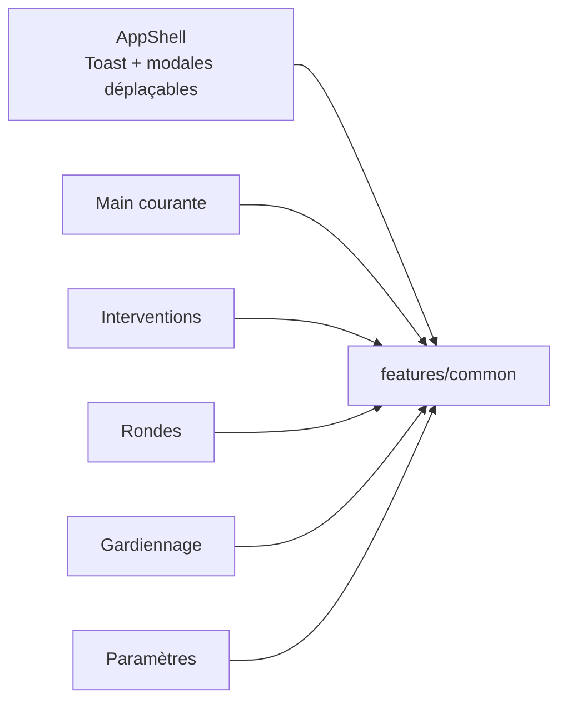

# Goron-GTS — Module `src/features/common` (vue responsables)

Présentation **non technique** du module **commun** de l’interface : briques réutilisées par plusieurs pages métier (tableaux, modales, notifications, référentiels en attente).

> **Périmètre** : `src/features/common` uniquement (composants, hooks, utilitaires). Le shell global (toasts globaux, modales déplaçables) est branché depuis `src/app` (`AppShell`).

---

## 1. Pourquoi ce module existe

Sans ce module, chaque page (main courante, interventions, rondes, gardiennage, paramètres) recréerait les mêmes écrans :

- filtres et pagination de listes ;
- confirmation avant abandon d’une saisie ;
- proposition de **site** ou **prestataire** « en attente de validation » ;
- interrupteurs (permissions, options) cohérents ;
- messages courts en bas d’écran.

**`features/common`** centralise ces comportements pour une expérience homogène et une maintenance plus simple.

---

## 2. Rôle global en une phrase

**`features/common` est la boîte à outils interface** partagée par toutes les pages métier : listes, modales de création, confirmations, copies de code site et référentiels proposés avant enregistrement.

---

## 3. Les briques (sans jargon code)

### Composants visibles

| Brique | Rôle pour l’utilisateur |
|--------|------------------------|
| **Barre de filtres** | Recherche texte, dates, bouton réinitialiser (icône) |
| **Barre de pagination** | Page courante, taille de page, option « tout afficher » |
| **Interrupteur (switch)** | Activer/désactiver une option ou une permission (pas une case à cocher brute) |
| **Toast** | Message court (succès, erreur, copie) qui disparaît seul |
| **Modale de confirmation** | Valider ou annuler une action sensible (suppression, abandon de saisie) |
| **En-tête / pied de modale création** | Titre et boutons Enregistrer / Annuler harmonisés |
| **Section de formulaire** | Bloc titré dans les longues modales |
| **Site / prestataire introuvable** | Proposer un nouveau référentiel avant de valider la fiche |
| **Copie code site** | Clic sur le libellé « Nom (CODE) » pour copier le code |
| **Partage identifiants** | Afficher mot de passe temporaire après création de compte (paramètres) |

### Comportements « invisibles » (hooks / utilitaires)

| Brique | Rôle pour l’utilisateur |
|--------|------------------------|
| **Filtres + pagination (état)** | Changer un filtre remet la liste à la page 1 |
| **Tri des colonnes** | Clic sur en-tête de colonne pour trier ascendant / descendant |
| **Garde fermeture création** | Échap ou Annuler avec saisie en cours → « Abandonner ? » |
| **Modales déplaçables** | Glisser l’en-tête ; double-clic pour recentrer |
| **Référentiels avant enregistrement** | Création automatique des propositions « en attente » si champs remplis |
| **Extraction code site** | Copie du code entre parenthèses sans afficher d’identifiant technique |

---

## 4. Schéma : qui consomme le module commun

---

## 5. Parcours utilisateur types

| Situation | Ce que voit l’utilisateur | Résultat attendu |
|-----------|---------------------------|------------------|
| **Liste longue** | Filtres + pages | Trouver une fiche sans scroller des milliers de lignes |
| **Création interrompue** | Confirmation abandon | Pas de perte silencieuse ; choix explicite |
| **Site absent du référentiel** | Formulaire « site introuvable » | Proposition en attente puis enregistrement de la fiche |
| **Copie code pour radio / rapport** | Clic libellé site | Code copié, message toast |
| **Droits utilisateur** | Switches dans Paramètres | Même look que les options rondes / gardiennage |

---

## 6. Ce que le travail récent apporte (documentation mai 2026)

Le dossier a été **documenté intégralement** (17 commits `docs(ui): JSDoc …` poussés sur `dev`) :

- 11 composants ;
- 4 hooks ;
- 2 utilitaires.

**Audit code mort** : aucune fonction, composant ou export inutilisé supprimé — tout le périmètre est référencé par au moins une page ou un composant consommateur.  
*Note* : `extractSiteCode` n’est importé que dans son fichier utilitaire (usage interne à la copie) ; ce n’est pas du code mort, seulement un export non réutilisé ailleurs pour l’instant.

---

## 7. Inventaire technique (référence rapide)

| Dossier | Fichiers |
|---------|----------|
| `components/` | ConfirmModal, CreateEntryModalChrome, CreateFormSection, CredentialShareCard, CredentialShareModal, PendingSiteIntervenantRefActions, SiteDisplayCopyButton, TableFiltersBar, TablePaginationBar, Toast, ToggleSwitch |
| `hooks/` | useCreateModalCloseGuard, useGlobalDraggableModals, useTableFilters, useTableSort |
| `utils/` | pendingRefsBeforeSave, siteDisplayCopy |

---

## 8. Ce que ce module ne fait pas

- **Règles métier** (statuts main courante, clôture ronde, planification gardiennage) → modules `features/*` dédiés
- **Authentification** → `features/auth`
- **Écriture base / audit** → Electron `store/domains`

---

## 9. Liens avec les autres fiches

| Zone | Fiche |
|------|--------|
| Connexion | [Presentation-src-features-auth.md](./Presentation-src-features-auth.md) |
| Bureau / writer | [Presentation-electron.md](./Presentation-electron.md) |
| Shell navigation | Fiche `src/app` à venir |

---

## 10. Message clé pour une présentation orale (30 secondes)

> Le module common, c’est tout ce qui se répète dans l’interface Goron-GTS : filtrer et paginer les listes, confirmer avant de perdre une saisie, proposer un site ou un prestataire en attente, copier un code site, et garder les mêmes interrupteurs et messages partout. Les pages métier s’y branchent au lieu de réinventer la roue.

---

*Fiche responsables — module `src/features/common` — mai 2026.*
