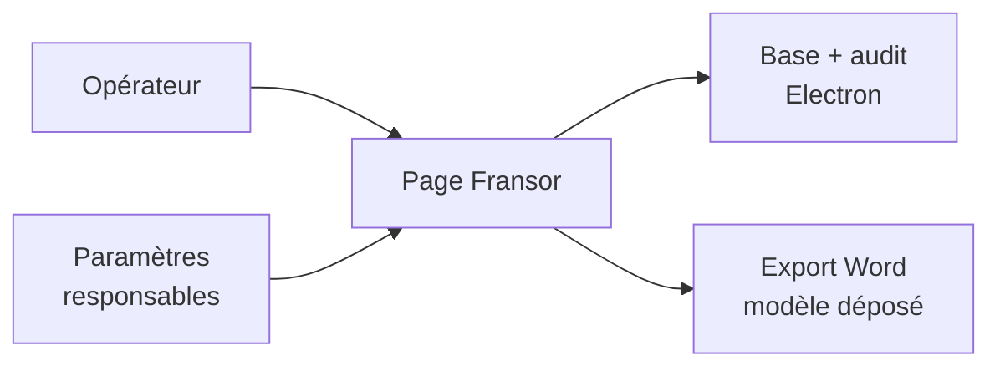

# Goron-GTS — Module `src/features/fransor` (vue responsables)

Présentation **non technique** du module **Fransor** : suivi des ouvertures et fermetures quotidiennes pour le client Fransor, avec récapitulatif mensuel par responsable.

> **Périmètre** : `src/features/fransor` (page, presenter, export Word, utilitaire modèle). Les **responsables** (liste, ajout, suppression) sont gérés dans **Paramètres** ; le moteur d’écriture et l’audit sont côté Electron (`store/domains/fransor`).

---

## 1. Pourquoi ce module existe

L’exploitation doit tracer, jour par jour :

- qui a réalisé l’**ouverture** et la **fermeture** pour le client Fransor ;
- les **jours non travaillés** (week-ends, fériés, fermetures exceptionnelles) ;
- un **récap mensuel** par responsable pour reporting (copie texte ou export Word).

Ce module dédie un écran à ce suivi, distinct de la main courante ou des rondes.

---

## 2. Rôle global en une phrase

**`features/fransor` est le tableau de bord Fransor** : calendrier du mois, saisie des actions du jour, exceptions calendrier et récap mensuel exportable.

---

## 3. Les briques (sans jargon code)

| Brique | Rôle pour l’utilisateur |
|--------|------------------------|
| **Sélecteur de mois** | Naviguer dans l’historique ; revenir au mois en cours |
| **Journée du jour** | Bouton direct pour saisir ou corriger aujourd’hui |
| **Calendrier 6 semaines** | Vue stable ; clic sur une date pour saisir |
| **À compléter / Renseignées** | Filtrer les jours passés encore incomplets ou déjà remplis |
| **Modale de saisie** | Cocher ouverture et/ou fermeture + choisir le responsable |
| **Périodes exceptionnelles** | Jours fermés ou ouverts hors règle habituelle (motif obligatoire) |
| **Récap mensuel** | Totaux par responsable ; copier ou exporter en Word |
| **Aide intégrée** | Rappel du fonctionnement (icône ?) |

---

## 4. Règles métier visibles

| Règle | Comportement |
|-------|----------------|
| **Jour « prévu »** | Lundi–vendredi, hors férié, sauf exception « ouverture forcée » |
| **Jour « non prévu »** | Week-end, férié, ou exception « fermeture » |
| **Responsable** | Choisi dans la liste Paramètres ; noms affichés, pas d’identifiant technique |
| **Suppression exception** | Motif obligatoire (audit) |

---

## 5. Schéma simplifié

---

## 6. Documentation technique (mai 2026)

4 fichiers documentés (JSDoc français, commits `docs(ui):` sur `dev`).

**Nettoyage code mort** lors de la revue :

- presenter : retrait `entryMap`, `createResponsable`, `deleteResponsable` (jamais utilisés par la page ; CRUD responsables = Paramètres) ;
- page + shell : retrait `refreshToken` / `fransorRefreshToken` (prop jamais consommée ; rechargement déjà assuré au montage de la page).

**Point d’attention** : `FransorPage.tsx` dépasse ~900 lignes — un découpage en composants (calendrier, modales, récap) est recommandé avant prochaine évolution majeure (règle projet 800 lignes).

---

## 7. Ce que ce module ne fait pas

- **Création / suppression des responsables** → Paramètres (onglet données / variables selon configuration)
- **Gestion des fériés** → référentiel partagé (lecture seule ici)
- **Main courante, rondes, gardiennage** → autres modules

---

## 8. Liens

| Zone | Fiche |
|------|--------|
| Composants partagés | [Presentation-src-features-common.md](./Presentation-src-features-common.md) |
| Electron Fransor | [Presentation-electron-store-domains.md](./Presentation-electron-store-domains.md) |

---

## 9. Message clé (30 secondes)

> Fransor, c’est le suivi des ouvertures et fermetures du client : un calendrier par mois, une saisie rapide par jour et par responsable, des exceptions pour les jours spéciaux, et un récap mensuel que l’on peut copier ou exporter en Word pour le reporting.

---

*Fiche responsables — module `src/features/fransor` — mai 2026.*
