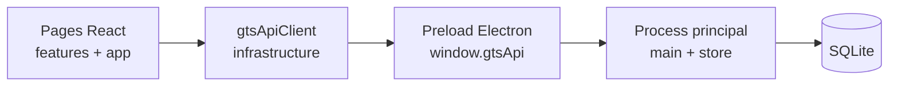

# Goron-GTS — Dossier `src/infrastructure` (vue responsables)

Présentation **non technique** de la couche qui relie l’interface React au **backend Electron** (base SQLite, writer, audit).

> **Périmètre** : `src/infrastructure` (fichier unique `api/gtsApiClient.ts`). Le code métier côté poste maître est documenté dans les fiches **Electron** (`main`, `store/domains`).

---

## 1. Pourquoi ce dossier existe

Les écrans métier (main courante, interventions, rondes, etc.) ne parlent pas directement à la base de données. Ils passent par un **pont unique** :

- l’application de bureau expose une API sécurisée (`window.gtsApi`, préparée au démarrage) ;
- le frontend regroupe tous les appels dans **`gtsApiClient`**.

Cela garantit un comportement homogène : **session**, **droits**, **gestion d’erreur** et **typage** des échanges.

---

## 2. Rôle global en une phrase

**`src/infrastructure` est la ligne téléphonique unique** entre l’interface utilisateur et les services Electron (lecture/écriture, writer, paramètres, audit).

---

## 3. Ce que fait concrètement le client API

| Fonction | Intérêt exploitation |
|----------|----------------------|
| **Session** | Chaque action authentifiée embarque le jeton ; si la session expire, l’utilisateur est renvoyé à la connexion |
| **Writer** | État maître/backup, connectivité, statistiques de file d’attente (badges sidebar) |
| **Base & archives** | Configuration SQLite, bascule de base, archivage trimestriel |
| **Comptes & audit** | Utilisateurs, journal d’actions, préférences (thème) |
| **Référentiels** | Sites, intervenants, types, fériés, motifs ronde, responsables Fransor, pending |
| **Modules métier** | Main courante, intervention, ronde, gardiennage, Fransor, variables/modèles Word |

Les **presenters** des pages (`useRondePresenter`, `useSettingsPresenter`, etc.) appellent ce client ; ils ne contiennent pas la logique d’accès disque.

---

## 4. Schéma simplifié

En mode **client** (poste sans writer actif), les écritures sensibles peuvent transiter par le **writer** distant ou une **file** — l’UI reste la même, seul le chemin réseau change.

---

## 5. Ce que ce dossier n’est pas

- Ce n’est **pas** l’écran Paramètres (voir [Presentation-src-features-settings.md](./Presentation-src-features-settings.md)).
- Ce n’est **pas** la règle métier détaillée (statuts ronde, clôture main courante, etc.) — elle vit dans **Electron / domains** et les **features**.
- Les utilisateurs **ne voient jamais** ce fichier : aucun libellé ni bouton ne provient directement de `infrastructure`.

---

## 6. Documentation technique

- **Code** : JSDoc en français sur `gtsApiClient.ts` (point d’entrée, session, façade `gtsApiClient`, types writer/archives).
- **Volume** : un seul fichier (~950 lignes) — normal pour une façade IPC centralisée ; les évolutions ajoutent une méthode par nouveau canal backend.

---

## 7. Liens

| Zone | Fiche |
|------|--------|
| Shell & navigation | [Presentation-src-app.md](./Presentation-src-app.md) |
| Backend poste | [Presentation-electron.md](./Presentation-electron.md) |
| Paramètres (UI admin) | [Presentation-src-features-settings.md](./Presentation-src-features-settings.md) |

---

*Document interne — dossier personnel, hors dépôt Git.*
