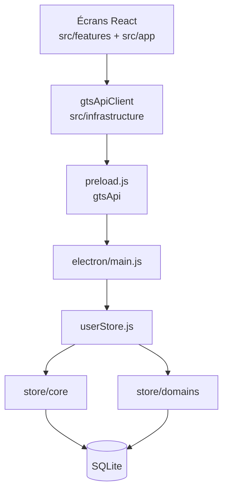

# Goron-GTS

Application de bureau pour la gestion opérationnelle des activités terrain en **station** : main courante, interventions, rondes, gardiennage et Fransor. Fonctionnement **local** (réseau LAN), base SQLite, mode **writer** multi-postes (Maître / Backup / clients).

**Version** : 1.0.63 (voir `package.json`)

---

## Objectif produit

Goron-GTS centralise la saisie, le suivi et la traçabilité des actions opérationnelles, tout en garantissant :

- une expérience simple pour les équipes terrain ;
- une continuité de service en cas d’indisponibilité partielle du poste Maître ;
- un **journal d’audit** exploitable pour le support et le contrôle ;
- des **droits par profil** (opérateur, responsable, accès par page).

---

## Modules métier

| Module | Rôle (résumé) |
|--------|----------------|
| **Main courante** | Journal d’exploitation : signalements, suivi responsable, clôture, exports |
| **Intervention** | Création et suivi des interventions, statuts, facturation, lien rondes |
| **Rondes** | Passages planifiés (profils contractuels), demandes d’urgence, fiches de clôture |
| **Gardiennage** | Planification et suivi des demandes de gardiennage |
| **Fransor** | Ouvertures / fermetures et récapitulatifs par jour et par mois |
| **Paramètres** | Comptes, référentiels, modèles Word, variables, base, journal d’actions |
| **Aide** | Centre d’aide intégré (rubriques par module et par écran Paramètres) |

Chaque module suit une structure **MVP** : `view` / `presenter` / `model` / `components` sous `src/features/<module>/`.

---

## Architecture

### Vue d’ensemble



### Stack

| Couche | Technologie | Rôle |
|--------|-------------|------|
| Interface | React + TypeScript (Vite) | Pages métier, shell (`AppShell`), session |
| Pont | `electron/preload.js` | Expose `window.gtsApi` (IPC sécurisé) |
| Bureau | Electron | Fenêtre, writer, archivage, tray |
| Métier | Node.js dans Electron | `userStore` + `store/domains/*` |
| Données | SQLite | Fichier local ou partage selon configuration station |

**Principes** : séparation stricte UI / logique métier ; `UserStore` comme **orchestrateur** (pas de règles métier volumineuses dans `userStore.js`) ; écritures sensibles via **un writer actif** à la fois ; audit des `INSERT` / `UPDATE` / `DELETE` métier.

### Organisation des dossiers

| Dossier | Contenu |
|---------|---------|
| `src/app/` | Coque applicative : session, sidebar, navigation, badges writer |
| `src/features/auth/` | Connexion, première connexion, mot de passe |
| `src/features/common/` | Composants UI partagés (modales, tableaux, toggles, toasts) |
| `src/features/*` | Modules métier (voir tableau ci-dessus) |
| `src/infrastructure/api/` | Client unique vers Electron (`gtsApiClient.ts`) |
| `electron/main.js` | Entrée processus principal, cycle de vie, IPC |
| `electron/main/` | Writer, base active, modèles Word, tray, handlers |
| `electron/store/core/` | Schémas, sessions, RBAC, audit transverse |
| `electron/store/domains/` | Règles métier par domaine (main courante, ronde, etc.) |

---

## Documentation complémentaire

Des **fiches responsables** (langage métier, sans code) décrivent chaque zone du projet. Elles sont maintenues dans le dossier personnel (souvent non versionné) :

**`Z_Dossier_Perso/Présentation/`**

Index : [`Index-presentations-par-dossier.md`](Z_Dossier_Perso/Présentation/Index-presentations-par-dossier.md)

| Zone | Fiche |
|------|--------|
| Electron (vue d’ensemble) | `Presentation-electron.md` |
| `electron/main` | `Presentation-electron-main.md` |
| `electron/store/core` | `Presentation-electron-store-core.md` |
| `electron/store/domains` | `Presentation-electron-store-domains.md` |
| `src/app` | `Presentation-src-app.md` |
| `src/infrastructure` | `Presentation-src-infrastructure.md` |
| `src/features/auth` | `Presentation-src-features-auth.md` |
| `src/features/common` | `Presentation-src-features-common.md` |
| `src/features/mainCourante` | `Presentation-src-features-mainCourante.md` |
| `src/features/intervention` | `Presentation-src-features-intervention.md` |
| `src/features/rondes` | `Presentation-src-features-rondes.md` |
| `src/features/gardiennage` | `Presentation-src-features-gardiennage.md` |
| `src/features/fransor` | `Presentation-src-features-fransor.md` |
| `src/features/help` | `Presentation-src-features-help.md` |
| `src/features/settings` | `Presentation-src-features-settings.md` |

Le **code source** est documenté par des en-têtes **JSDoc** (français) au niveau fichier ; conventions détaillées dans `.cursor/rules/`.

Réseau et sécurité poste : `Z_Dossier_Perso/RESEAU_ADMINISTRATEUR_IT.txt`

---

## Fonctionnement réseau (résumé)

- Usage **LAN** : pas d’Internet requis pour l’exploitation courante.
- Mode **writer** :
  - un poste **Maître** (écriture normale) ;
  - un poste **Backup** (reprise si Maître indisponible) ;
  - des postes **clients** (lecture + soumission au writer).
- Un **seul writer actif** à la fois ; file d’attente visible en mode dégradé.
- Maître et Backup doivent être **ouverts** pendant la plage d’exploitation pour assurer la continuité d’écriture.

---

## Sécurité (résumé)

- Authentification avec hash de mot de passe renforcé.
- Sessions limitées dans le temps ; déconnexion automatique si session invalide.
- Audit des écritures métier (libellés `[Page] Donnée` côté UI).
- Signature HMAC des échanges inter-postes writer ; protection anti-rejeu.
- Isolation Electron (`contextIsolation` + sandbox).

---

## Prérequis

- Windows 10/11 (environnement cible)
- Accès réseau local station
- Dossier de données configuré

---

## Installation et lancement (développement)

```bash
npm install
npm run dev
```

Lance l’UI Vite (`5173`) et Electron en parallèle.

---

## Build et distribution

| Commande | Usage |
|----------|--------|
| `npm run build` | Build UI (Vite → `dist/`) |
| `npm run dist:portable` | Exécutable portable Windows |
| `npm run dist:installer` | Installateur NSIS |
| `npm run dist:folder` | Dossier d’installation (sans installeur) |
| `npm run dist:win:all` | Portable + NSIS + dossier |

---

## Bonnes pratiques d’exploitation

- Installer l’application **localement** sur chaque poste de production.
- Éviter l’exécution directe depuis un partage réseau.
- Maintenir **Maître** et **Backup** ouverts pendant la plage d’exploitation.
- Surveiller l’état writer et les logs en cas d’incident (Paramètres / indicateurs sidebar).

---

## Statut du projet

Évolution par **incréments fonctionnels** sur la branche `dev`, avec objectif de stabilité opérationnelle et de maintenance long terme. Les fiches de présentation et le JSDoc sont tenus à jour au fil des modules livrés.
