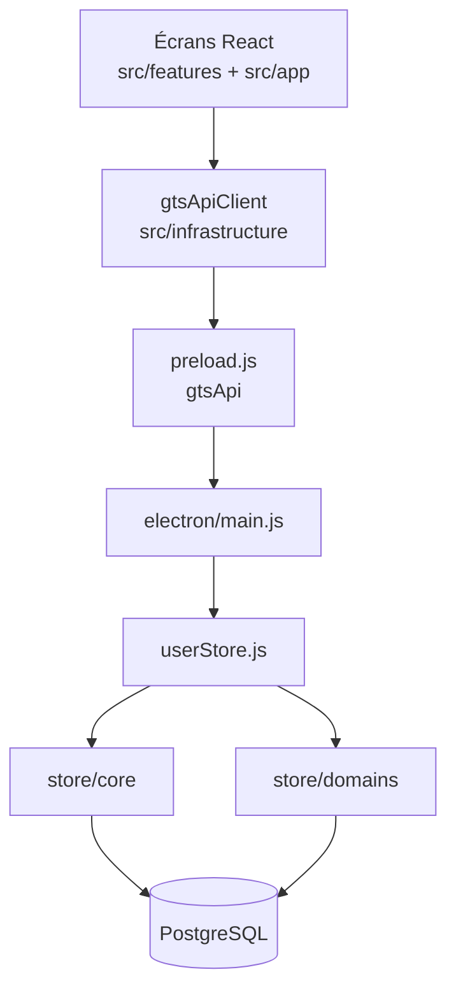

# Goron-GTS

Application de bureau pour la gestion opérationnelle des activités terrain en **station** : main courante, interventions, rondes, gardiennage et Fransor. Fonctionnement **local** (réseau LAN), base **PostgreSQL** en connexion directe (un serveur H24 ou VM ; chaque poste se connecte au moteur).

**Version** : voir `package.json`

---

## Objectif produit

Goron-GTS centralise la saisie, le suivi et la traçabilité des actions opérationnelles, tout en garantissant :

- une expérience simple pour les équipes terrain ;
- une continuité de service tant que le serveur PostgreSQL est joignable ;
- un **journal d’audit** exploitable pour le support et le contrôle ;
- des **droits par profil** (opérateur, responsable, accès par page).

---

## Modules métier

| Module | Rôle (résumé) |
|--------|----------------|
| **Main courante** | Journal d’exploitation : signalements, suivi responsable, clôture, exports |
| **Intervention** | Création et suivi des interventions, statuts, facturation, lien rondes |
| **Rondes** | Passages planifiés (profils contractuels), demandes d’urgence, fiches de clôture |
| **Gardiennage** | Planification et suivi des demandes de gardiennage |
| **Fransor** | Ouvertures / fermetures et récapitulatifs par jour et par mois |
| **Paramètres** | Comptes, référentiels, modèles Word, variables, connexion PostgreSQL, journal d’actions |
| **Aide** | Centre d’aide intégré (rubriques par module et par écran Paramètres) |

Chaque module suit une structure **MVP** : `view` / `presenter` / `model` / `components` sous `src/features/<module>/`.

---

## Architecture

### Vue d’ensemble



### Stack

| Couche | Technologie | Rôle |
|--------|-------------|------|
| Interface | React + TypeScript (Vite) | Pages métier, shell (`AppShell`), session |
| Pont | `electron/preload.js` | Expose `window.gtsApi` (IPC sécurisé) |
| Bureau | Electron | Fenêtre, tray, IPC, config PG chiffrée |
| Métier | Node.js dans Electron | `userStore` + `store/domains/*` |
| Données | PostgreSQL 18 (17 ok) | Serveur LAN ; compte technique unique |

**Principes** : séparation stricte UI / logique métier ; `UserStore` comme **orchestrateur** ; persistance via adaptateur async `pg` ; audit des `INSERT` / `UPDATE` / `DELETE` métier ; badge **DB accessible / inaccessible** en sidebar.

### Organisation des dossiers

| Dossier | Contenu |
|---------|---------|
| `src/app/` | Coque applicative : session, sidebar, navigation, badge DB |
| `src/features/auth/` | Connexion, première connexion, bootstrap PG (build packagé) |
| `src/features/common/` | Composants UI partagés (modales, tableaux, toggles, toasts) |
| `src/features/*` | Modules métier (voir tableau ci-dessus) |
| `src/infrastructure/api/` | Client unique vers Electron (`gtsApiClient.ts`) |
| `electron/main.js` | Entrée processus principal, cycle de vie, IPC |
| `electron/main/` | Config app, modèles Word, tray, handlers, admin PG |
| `electron/store/core/` | Sessions, RBAC, audit transverse |
| `electron/store/domains/` | Règles métier par domaine |
| `electron/store/persistence/` | Adaptateur PostgreSQL, schéma SQL, health-check |

---

## Documentation complémentaire

Des **fiches responsables** (langage métier, sans code) et le plan de migration PostgreSQL sont maintenus hors git :

**`Z_Dossier_Perso/`** (souvent non versionné)

- Plan migration : `Z_Dossier_Perso/Plan_Migration_PostgreSQL/`
- Fiche install production : `15-Installation-production.md`
- Réseau / SI : `Z_Dossier_Perso/RESEAU_ADMINISTRATEUR_IT.txt` (si présent)

Le **code source** est documenté par des en-têtes **JSDoc** (français) ; conventions dans `.cursor/rules/` (local).

---

## Fonctionnement réseau (résumé)

- Usage **LAN** : pas d’Internet requis pour l’exploitation courante.
- Un **serveur PostgreSQL** (PC H24 ou VM) ; chaque poste Goron-GTS pointe vers l’hôte/port.
- En indisponibilité serveur : badge DB rouge + modale bloquante ; **pas d’écriture** jusqu’au retour du service.
- Secret technique PG : fichier chiffré local (`safeStorage` / DPAPI) ; en développement, défauts Docker labo sans écran bootstrap.

---

## Sécurité (résumé)

- Authentification applicative avec hash de mot de passe renforcé.
- Sessions limitées dans le temps ; déconnexion automatique si session invalide.
- Audit des écritures métier (libellés `[Page] Donnée` côté UI).
- Isolation Electron (`contextIsolation` + sandbox).
- Compte PostgreSQL **technique** unique ; opérateurs = profils Goron-GTS.

---

## Prérequis

- Windows 10/11 (environnement cible)
- Accès réseau local au serveur PostgreSQL (port 5432)
- En développement : Docker `postgres:18` (recommandé, `docker-compose.yml`) ou PostgreSQL natif

---

## Installation et lancement (développement)

Guide **A à Z** (PC portable, Docker indépendant du poste fixe, usage hors ligne) : **[INSTALLATION.md](INSTALLATION.md)**.

Raccourci une fois Git, Node 22 et Docker Desktop installés :

```powershell
.\scripts\install-labo.ps1
npm run dev
```

Équivalent manuel :

```bash
docker compose up -d
npm ci
npm run dev
```

Lance l’UI Vite (`5173`) et Electron en parallèle. Deuxième instance locale : `npm run dev:2` (port `5174`).

Prérequis labo typique : conteneur `goron-pg18` joignable sur `127.0.0.1:5432` (base `goron_gts`, utilisateur `goron_gts_app`).

---

## Build et distribution

| Commande | Usage |
|----------|--------|
| `npm run build` | Build UI (Vite → `dist/`) |
| `npm run dist:portable` | Exécutable portable Windows |
| `npm run dist:installer` | Installateur NSIS |
| `npm run dist:folder` | Dossier d’installation (sans installeur) |
| `npm run dist:win:all` | Portable + NSIS + dossier |
| `npm run release:portable` | Release portable versionnée (script dédié) |

---

## Bonnes pratiques d’exploitation

- Installer l’application **localement** sur chaque poste de production.
- Éviter l’exécution directe depuis un partage réseau.
- Maintenir le **serveur PostgreSQL** allumé H24 et surveiller le badge DB.
- Sauvegardes : `pg_dump` hors disque système ; tester une restauration avant mise en service.

---

## Statut du projet

Évolution par **incréments fonctionnels** sur la branche `dev`. Persistance métier : **PostgreSQL only** (plus de SQLite / writer Master-Backup).
